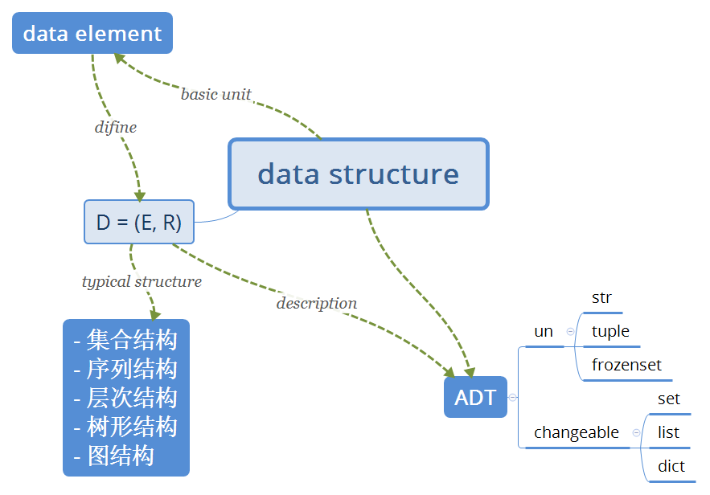
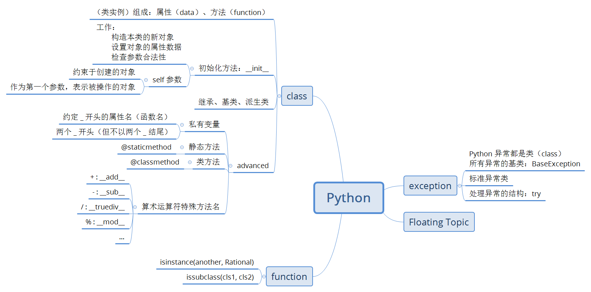

# 《数据结构与算法-Python语言描述》
> 作者：裘宗燕

1. ### 绪论

    _算法_

    

- ### 抽象数据类型和 Python 类

    _数据结构_

    

    _Python_

    

- ### 线性表

    + lst.reserve()

        ``` python
        def reserve(self):
            elems = self.elements
            i, j = 0, len(elems)-1
            while i < j:
                elems[i], elems[j] = elems[j], elems[i]
                i, j = i+1, j-1
        ```

