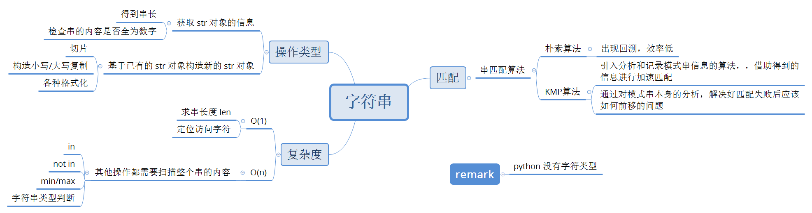

# 《数据结构与算法-Python语言描述》
> 作者：裘宗燕

1. ### 绪论

    _算法_

    

1. ### 抽象数据类型和 Python 类

    _数据结构_

    

    _Python_

    

1. ### 线性表

    

    - 顺序表

        + lst.reserve()

            ``` python
            def reserve(self):
                elems = self.elements
                i, j = 0, len(elems)-1
                while i < j:
                    elems[i], elems[j] = elems[j], elems[i]
                    i, j = i+1, j-1
            ```

    - 单链表

        + 定义一个表结点

            ``` python
            class LNode:
                def __init__(self, elem, next_=None):
                    self.elem = elem
                    self.next = next_
            ```

        + 插入元素

            ``` python
            q = LNode(13)
            q.next = pre.next
            pre.next = q
            ```

        + 遍历

            ``` python
            p = head
            while p is not None:
                print(p.elem)
                p = p.next
            ```

        + 求表长

            ``` python
            def length(head):
                p, num = head, 0
                while p is not None:
                    p = p.next
                    ++num
                return num
            ```

        + 定义表结点基础上（参前），对单链表操作

            ``` python
            # 循环建立起一个列表，结点元素取 1-10
            llist1 = LNode(1)
            p = llist1
            for i in range(2, 11):
                p.next = LNode(i)
                p = p.next
            ```

        + append()

            ``` python
            def append(self, elem)

                # 原表为空，引用新结点的就应该是表对象的 _head 域
                if self._head is None:
                    self._head = LNode(elem)
                    return
                p = self._head
                while p.next is not None:
                    p = p.next
                p.next = LNode(elem)
            ```

        + pop_last()

            ``` python
            def pop_last(self)

                # 空表
                if self._head is None:
                    raise LinkedListUnderflow("in pop_last")
                p = self._head

                # 表中只有一个元素
                if p.next is None:
                    e = p.elem
                    self._head = None
                    return e

                # 直到 p.next 是最后结点
                while p.next.next is not None:
                    p = p.next
                e = p.elem.next
                p.next = None
                return e
            ```

    - 汇集对象-生成器

        

        + LList 类定义对象的一个迭代器

            ``` Python
            def elements(self):
                p = self._head
                while p is not None:
                    yield p.elem
                    p = p.next
            ```

            有了这个方法，代码中可以写

            ``` Python
            for x in llist1.elements()
                print(x)
            ```

    - 循环单链表

        ``` python
        class LCList:   # 循环单链表类
            def __init__(self):
                self._rear = None

            def is_impety(self):
                return self._rear is None

            def prepend(self, elem)   # 前端插入
                p = LNode(elem)
                if self._rear is None:
                    p.next = p   # 建立一个节点的环
                    self._rear = p
                else:
                    p.next = self._rear.next
                    self>_rear = p

            def apppend(self, elem):   # 尾端插入
                self.prepend(elem)
                self._rear = self._rear.next

            def pop(self):   # 尾端弹出
                if self._rear is None:
                    raise LinkedListUnderflow("in pop of CLList")
                p = self._rear.next
                if self._rear is p:
                    self._rear = None
                else:
                    self._rear.next = p.next
                return p.elem

            def printall(self):   # 输出表元素
                if self.is_impety():
                    return
                p = self._rear.next
                while true:
                    print(p.elem)
                    if p is self._rear:
                        break
                    p = p.next
        ```

    - 双链表

        ``` pyhton
        # 删除结点
        p.pre.next = p.next
        p.next.pre = p.pre
        ```

    - Josephus 问题
        > n 个人围坐，从第 k 个人报数，报数到第 k 个人出局
    
        基于循环单链表的解

        ``` python
        class Josephus(LCList):
            def turn(self, m):
                for i in range(m):
                    self._rear = self._rear.next

            def __init__(self, n, k, m):
                LCList.__init__(self)
                for i in range(n):
                    self.append(i+1)
                self.turn(k-1)
                while not self.is_impety():
                    self.turn(m-1)
                    print(self.pop(),
                            end=("\n" if self.is_impety() else ", "))
        ```

1. ### 字符串

    

    - 朴素的串匹配算法

        ``` python
        def naive_matching(t, p):
            m, n = len(p), len(t)
            i, j = 0, 0
            while i < m and j < n:      # i==m 说明找到匹配
                if p[i] == t[j]:        # 字符相同，考虑下一对字符
                    i, j = i+1, j+1
                else:                   # 字符不同，考虑 t 中下一位置
                    i, j = 0, j-i+1
                if i == m:              # 找到匹配，返回其开始下标
                    return j - i
                return -1               # 无匹配，返回特殊值
        ```


    
