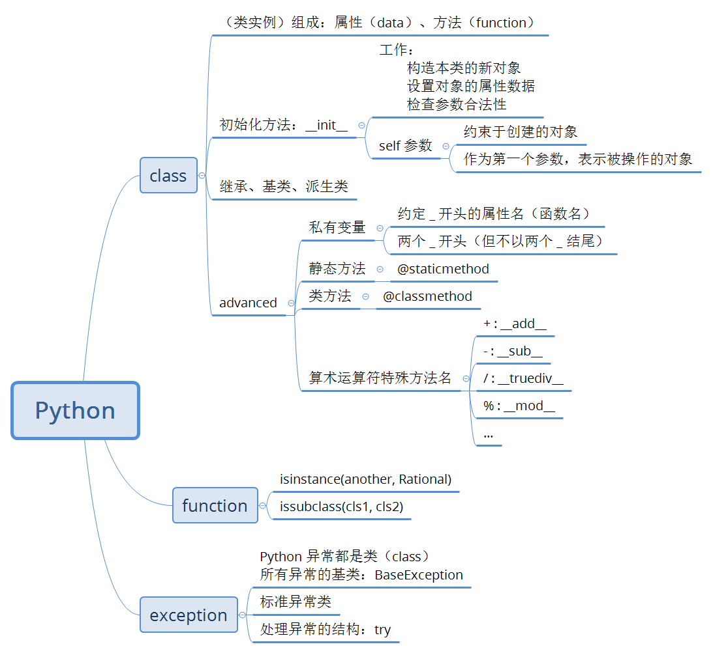

# 《数据结构与算法-Python语言描述》
> 作者：裘宗燕

1. ### 绪论

    _算法_

    

1. ### 抽象数据类型和 Python 类

    _数据结构_

    

    _Python_

    

1. ### 线性表

    

    - 顺序表

        + lst.reserve()

            ``` python
            def reserve(self):
                elems = self.elements
                i, j = 0, len(elems)-1
                while i < j:
                    elems[i], elems[j] = elems[j], elems[i]
                    i, j = i+1, j-1
            ```

    - 单链表

        + 定义一个表结点

            ``` python
            class LNode:
                def __init__(self, elem, next_=None):
                    self.elem = elem
                    self.next = next_
            ```

        + 插入元素

            ``` python
            q = LNode(13)
            q.next = pre.next
            pre.next = q
            ```

        + 遍历

            ``` python
            p = head
            while p is not None:
                print(p.elem)
                p = p.next
            ```

        + 求表长

            ``` python
            def length(head):
                p, num = head, 0
                while p is not None:
                    p = p.next
                    ++num
                return num
            ```

        + 定义表结点基础上（参前），对单链表操作

            ``` python
            # 循环建立起一个列表，结点元素取 1-10
            llist1 = LNode(1)
            p = llist1
            for i in range(2, 11):
                p.next = LNode(i)
                p = p.next
            ```

        + append()

            ``` python
            def append(self, elem)

                # 原表为空，引用新结点的就应该是表对象的 _head 域
                if self._head is None:
                    self._head = LNode(elem)
                    return
                p = self._head
                while p.next is not None:
                    p = p.next
                p.next = LNode(elem)
            ```

        + pop_last()

            ``` python
            def pop_last(self)

                # 空表
                if self._head is None:
                    raise LinkedListUnderflow("in pop_last")
                p = self._head

                # 表中只有一个元素
                if p.next is None:
                    e = p.elem
                    self._head = None
                    return e

                # 直到 p.next 是最后结点
                while p.next.next is not None:
                    p = p.next
                e = p.elem.next
                p.next = None
                return e
            ```
