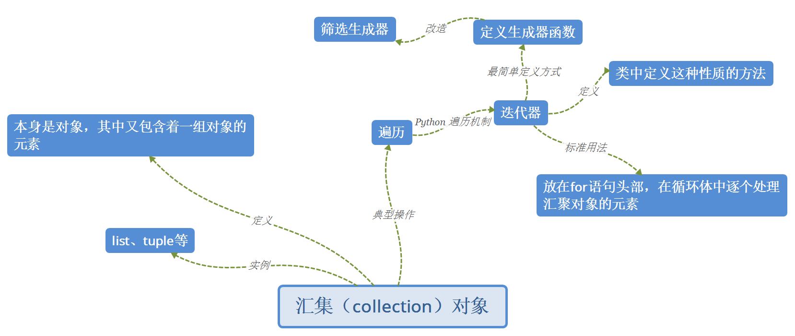

# 《数据结构与算法-Python语言描述》
> 作者：裘宗燕

1. ### 绪论

    _算法_

    

1. ### 抽象数据类型和 Python 类

    _数据结构_

    

    _Python_

    

1. ### 线性表

    

    - 顺序表

        + lst.reserve()

            ``` python
            def reserve(self):
                elems = self.elements
                i, j = 0, len(elems)-1
                while i < j:
                    elems[i], elems[j] = elems[j], elems[i]
                    i, j = i+1, j-1
            ```

    - 单链表

        + 定义一个表结点

            ``` python
            class LNode:
                def __init__(self, elem, next_=None):
                    self.elem = elem
                    self.next = next_
            ```

        + 插入元素

            ``` python
            q = LNode(13)
            q.next = pre.next
            pre.next = q
            ```

        + 遍历

            ``` python
            p = head
            while p is not None:
                print(p.elem)
                p = p.next
            ```

        + 求表长

            ``` python
            def length(head):
                p, num = head, 0
                while p is not None:
                    p = p.next
                    ++num
                return num
            ```

        + 定义表结点基础上（参前），对单链表操作

            ``` python
            # 循环建立起一个列表，结点元素取 1-10
            llist1 = LNode(1)
            p = llist1
            for i in range(2, 11):
                p.next = LNode(i)
                p = p.next
            ```

        + append()

            ``` python
            def append(self, elem)

                # 原表为空，引用新结点的就应该是表对象的 _head 域
                if self._head is None:
                    self._head = LNode(elem)
                    return
                p = self._head
                while p.next is not None:
                    p = p.next
                p.next = LNode(elem)
            ```

        + pop_last()

            ``` python
            def pop_last(self)

                # 空表
                if self._head is None:
                    raise LinkedListUnderflow("in pop_last")
                p = self._head

                # 表中只有一个元素
                if p.next is None:
                    e = p.elem
                    self._head = None
                    return e

                # 直到 p.next 是最后结点
                while p.next.next is not None:
                    p = p.next
                e = p.elem.next
                p.next = None
                return e
            ```

    - 汇集对象-生成器

        

        + LList 类定义对象的一个迭代器

            ``` Python
            def elements(self):
                p = self._head
                while p is not None:
                    yield p.elem
                    p = p.next
            ```

            有了这个方法，代码中可以写

            ``` Python
            for x in llist1.elements()
                print(x)
            ```

    - 循环单链表

        ``` python
        class LCList:   # 循环单链表类
            def __init__(self):
                self._rear = None

            def is_empety(self):
                return self._rear is None

            def prepend(self, elem)   # 前端插入
                p = LNode(elem)
                if self._rear is None:
                    p.next = p   # 建立一个节点的环
                    self._rear = p
                else:
                    p.next = self._rear.next
                    self>_rear = p

            def apppend(self, elem):   # 尾端插入
                self.prepend(elem)
                self._rear = self._rear.next

            def pop(self):   # 尾端弹出
                if self._rear is None:
                    raise LinkedListUnderflow("in pop of CLList")
                p = self._rear.next
                if self._rear is p:
                    self._rear = None
                else:
                    self._rear.next = p.next
                return p.elem

            def printall(self):   # 输出表元素
                if self.is_empety():
                    return
                p = self._rear.next
                while true:
                    print(p.elem)
                    if p is self._rear:
                        break
                    p = p.next
        ```

    - 双链表

        ``` pyhton
        # 删除结点
        p.pre.next = p.next
        p.next.pre = p.pre
        ```

    - Josephus 问题
        > n 个人围坐，从第 k 个人报数，报数到第 k 个人出局
    
        基于循环单链表的解

        ``` python
        class Josephus(LCList):
            def turn(self, m):
                for i in range(m):
                    self._rear = self._rear.next

            def __init__(self, n, k, m):
                LCList.__init__(self)
                for i in range(n):
                    self.append(i+1)
                self.turn(k-1)
                while not self.is_empety():
                    self.turn(m-1)
                    print(self.pop(),
                            end=("\n" if self.is_empety() else ", "))
        ```

1. ### 字符串

    

    - 朴素的串匹配算法

        ``` python
        def naive_matching(t, p):
            m, n = len(p), len(t)
            i, j = 0, 0
            while i < m and j < n:      # i==m 说明找到匹配
                if p[i] == t[j]:        # 字符相同，考虑下一对字符
                    i, j = i+1, j+1
                else:                   # 字符不同，考虑 t 中下一位置
                    i, j = 0, j-i+1
                if i == m:              # 找到匹配，返回其开始下标
                    return j - i
                return -1               # 无匹配，返回特殊值
        ```

        复杂度分析： O(n*m)

    - KMP 匹配函数

        ``` python
        def matching_KMP(t, p, pnext):
            """""" KMP 串匹配，主函数 """"""
            j, i = 0, 0
            n, m = len(t), len(p)
            while j < n and i < m:              # i==m 说明找到了匹配
                if i == -1 or t[j] == p[i]:     # 考虑 p 中下一字符
                    j, i = j+1, i+1
                else:                           # 失败，考虑 pnext 决定的下一字符
                    i = pnext[i]
                if i == m:                      # 找到匹配，放回其下标
                    return j-i
                return -1                       # 无匹配，返回特殊值
        ```

        复杂度分析： O(n)，n 为目标串长度

        pnext 表的构造算法

        ``` python
        def gen_pnext(p):
            """生成针对 p 中各位置 i 的下一个检查位置表，用于 KMP 算法"""
            i, k, m = 0, -1, len(p)
            pnext = [-1] * m                    # 初始数组元素全为 -1
            while i < m-1:                      # 生成下一个 pnext 元素值
                if k == -1 or p[i] == p[k]:
                    i, k = i+1, k+1
                    if p[i] == p[k]:
                        pnext[i] = pnext[j]     # 设置 pnext 元素
                else:
                    pnext[i] = k                # 退到更短相同前缀
            return pnext
        ```

        复杂度分析： O(m)，m 为模式串长度

        KMP 算法时间复杂度：O(n+m)，多数情况下 m << n 

        故，O(n+m) ==> O(n)

        优于朴素算法的 O(n*m)

    - 正则表达式 Regular Expression

        

1. ### 栈和队列

    

    - 栈e

    - 队列类的实现

        ``` python
        class SQueue():e
        ```

1. ### 二叉树和树

    

    - 基于堆的优先队列类

        ``` python
        class PrioQuue:
            ``` Implementing priority queues using heaps
            ```
            def __init__(self, elist=[]):
                self._elems = list(elist)
                if elist:
                    sekf.buildheap()

                def is_empty(self):
                    return not self._elems
                def peek(self):
                    if self.is_empety():
                        raise PrioQueueError("in peek")
                    return self._elems[0]
        ```

    - 二叉树的类实现

        二叉树结点类

        ``` pyhton
        class BinTNode:
            def __init__(self, dat, left=None, right=None):
                self.data = dat
                self.left = left
                self.right = right
        ```

        构造包含三个结点的二叉树，变量 t 引着树根结点
        > 具有递归的结构，容易采用递归方式处理

            t = BinTNode(1, BinTNode(2), BinTNode(3))

        ``` pyhton
        # 统计树中结点的个数
        def count_BinTNodes(t):
            if t is None:
                return 0
            else:
                return 1 + count_BinTNodes(t.left) \
                       + count_BinTNodes(t.right)

        # 假设结点中保存数值，求这种二叉树里的所有数值和：
        def sum_BinTNodes(t):
            if t is None:
                return 0
            else:
                return dat + sum_BinTNodes(t.left) \
                       + sum_BinTNodes(t.right)
        ```

    - 二叉树遍历

        + 深度优先方式-递归

            ``` pyhton
            # 先根序遍历
            def preorder(t, proc):  # proc 是具体的节点数据的操作
                if t is None:
                    return
                proc(t.data)
                preoder(l.left)
                preoder(l.right)
            ```

            输出二叉树

            ``` pyhton
            def print_BinTNodes(t):
                if t is None:
                    print("^", end="")              # 空树输出 ^
                    return
                print("(" + STR(t.data), end="")
                print_BinTNodes(l.left)
                print_BinTNodes(l.right)
                print(")", end="")
            ```

        + 宽度优先遍历

            队列实现

        + 通过生成器函数遍历

1. ### 图

    

    - 邻接矩阵的实现

        ``` python
        class Graph:                            # 基本图类，采用邻接矩阵表示
            def __init__(self, mat, unconn=0):
                vnum = len(mat)
                for x in max:
                    if len(x) != vnum:          # 检查是否为方阵
                        raise ValueError("Argument for 'Graph'.")
                    self._mat = [mat[i][:] for i in range(vnum)]    # 做拷贝
                    self._unconn = unconn
                    self._vnum = vnum

                def vertex_num(self):
                    return self._vnum

                def _invalid(self, v):
                    return 0 > v or v >= self._vnum

                def add_vertex(self):
                    raise GraphError(
                        "Adj-Matrix does not support 'add_vertex'")

                def add_edge(self, vi, vj, val=1):
                    if self._invalid(vi) or self._invalid(vj):
                        raise GraphError(str(vi) + 'or' +str(vj) +
                                        "is not a valid vertex")
                    return self._mat[vi][vj]
        ```

    - 深度优先遍历的非递归算法

        ``` pyhton
        def DFS_graph(graph, v0):
            vnum = graph.vertex_num()
            visited = [0]*vnum                  # visited 记录已访问顶点
            visited[v0] = 1
            DFS_seq = [v0]                      # DFS_seq 记录遍历序列
            st = SStack()
            st.push((0, graph.out_edges(v0)))   # 入栈(i, edges)，说明
            while not st.is_empety():           # 下次应访问边 edges[i]
                i, edges = st.pop()
                if i < len(edges):
                    v, e = edges[i]
                    st.push((i+1, edges))       # 下次回来将访问 edges[i]
                    if not visited[v]:          # v 未访问，访问并记录其可达顶点
                        DFS_seq.append(v)
                        visited[v] = 1
                        st.push((0, graph.out_edges(v)))
                        # 下面访问的边组
            return DFS_seq
        ```

    - 最小生成树

        Kruskal 算法

            T = (v, {})
            while T中所含边数小于n-1：
                从E中选取当前最小边(u,v)，将它们从E中删除
                if (u,v)两端点属于T的不同连通分量：
                    将边(u,v)加入T

1. ### 字典和集合

    

    - 在元素有序的表上做二分法检索

        ``` pyhton
        def bisearch(lst, key):
            low, high = 0, len(lst)-1
            while low <= high:                  # 范围内还有元素
                mid = low + (high-low)//2
                if key == lst[mid].key:
                    return lst[mid].value
                if key < lst[mid].key:
                    high = mid - 1              # 在低半区继续
                else:
                    low = mid + 1               # 在高半区继续
        ```

        复杂度分析：O(log n)

1. ### 排序

    


