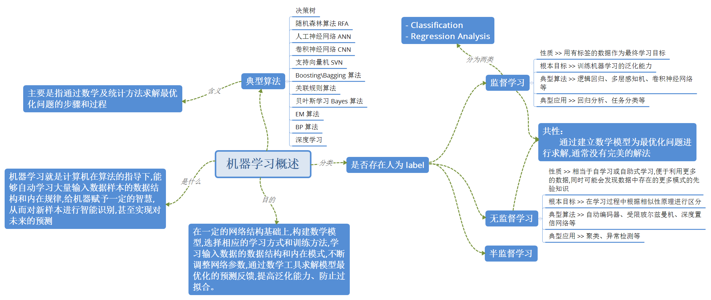

### Machine Learning

> 参考文献：[1]张润,王永滨. 机器学习及其算法和发展研究[J]. 中国传媒大学学报(自然科学版),2016,23(02):10-18+24. [2017-09-28]. DOI：10.16196/j.cnki.issn.1673-4793.2016.02.002

这个脑图主要是根据参考文献画的，很片面、敷衍。关于机器学习并没有表达具体的实质性内容。先填坑，就当交作业了。

还可以读读下面这个。

[机器学习实践指南](./机器学习实践指南.doxc)

[2017校招面经（BAT、搜狗、搜狐、一点资讯、360、华为优招）](http://blog.csdn.net/a819825294/article/details/52814653)
> 大致能从中清楚些机器学习的方向。
> 
> 这个学长很牛，里面也有关于 python 的博客。
