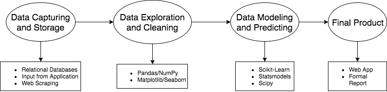

# Pandas

「Pandas」这个名字来源于术语「panel data」，指的是统计和计量经济学上的多维数据。

Pandas 包含高级数据结构，以及和让数据分析变得快速、简单的工具。

它建立在 NumPy 之上，使以 NumPy 为中心的应用变得简单。

- 带有坐标轴的数据结构，支持自动或明确的数据对齐。这能防止由于数据没有对齐，以及处理不同来源的、采用不同索引的数据而产生的常见错误。

- 使用 Pandas 更容易处理缺失数据。

- 合并流行数据库（如：基于 SQL 的数据库）中能找到的关系操作。

Pandas 是进行数据清洗 / 整理（data munging）的最好工具。

***

可以完成的任务

- 读 / 写不同格式的数据

        pd.read_csv()
    > pd.read_csv 会将数据载入一个 DataFrame 中。它本质上是一张电子表格或是数据表。

- 选择数据的子集

    **.describe()** 输出的内容或者用 **.columns** 以数组形式输出 DataFrame 中所有的列名称。

    使用 **.iloc[i]** 得到某行数据。

    同时处理行和列

        csv_data['age'].iloc[5]

- 跨行 / 列计算

- 寻找并填写缺失的数据

- 在数据的独立组中应用操作

- 重塑数据成不同格式

- 合并多个数据集

- 先进的时序功能

- 通过 matplotlib 和 seaborn 进行可视化操作

Pandas 通常是被用在数据采集和存储以及数据建模和预测中间的工具，作用是数据挖掘和清理。

[Pandas 官方文档](https://pandas.pydata.org/pandas-docs/stable/)
