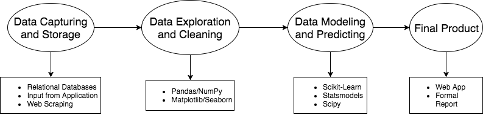

# Data Mining

## egs

- [Titanic](titanic/titanic.md)

- [Digit Recognizer](digit_recognizer/readme.md)

## description

Further more

> [Mind Mapping Reference](http://www.jianshu.com/p/32def2294ae6)

### 阅读材料

- [知乎：特征工程到底是什么？](https://www.zhihu.com/question/29316149)

- [Competition platform](competition_platform.md)

- [特征选择方法](特征选择方法.pdf)
