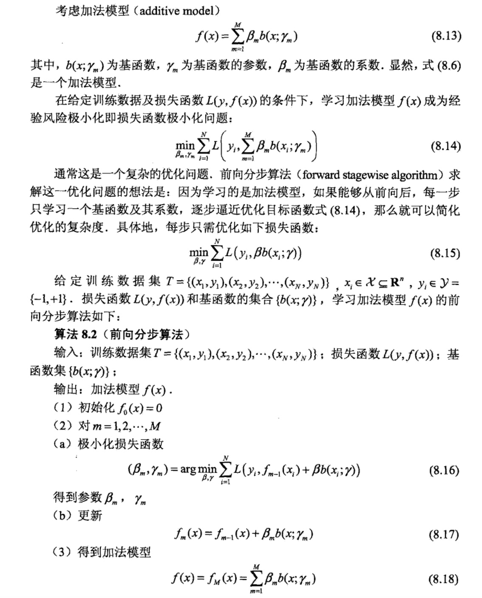

# GBDT 的那些事儿

- ## gist

    要介绍 GBDT，就不能不介绍其他相关的算法，比如 Adaboost、随机森林等。我会简要说明这些算法

    重点从这些算法和 GBDT 的区别上来说明 GBDT。

    我还会介绍 GBDT 各种演变、参数的含义和我理解的这类模型的使用场景和相关参数的建议。

- ## 集成学习（ensemble learning）

    GDBT、Adaboost、随机森林等

    含义

        通过结合多个学习器（或者说预测方法），来产生新的预测方法。

    组合成最后的预测方法的单位称为个体学习器

        个体学习器也被称为基学习器（base learner）

    关键和核心

        如何产生 “好而不同” 的个体学习器

    + ### Boosting

        Boost，提升。指的是如何将比较弱的个体学习器增强的方案。

        Boost 通过迭代，找到样本的划分阈值（一个维度上可能有多个阈值组合多次），重复 T 轮后组合这些个体学习器，得到最后的增强的结果。

        常用的迭代方法

            重赋权法（re-weighting）：适用于可以接受带权样本的基学习器（损失函数对样本加权计算）
            重采样法（re-sampling）：适用于无法接受带权样本的基学习器（抽样时不同样本抽中的概率不同）

        * #### Adaboost

            - 一种十分常见的 boost 算法

            - 核心思想

                通过迭代，给错误的样本更高的权重，以此来不断更新个体学习器，最后加权组合每一步的个体学习器来实现预测

            - 算法

                1. 初始，给予每个样本相同的权重 1/n，其中 n 为样本个数
                2. 进行多轮迭代 m=1，2，3…
                    a) 找到在这个权重下的一个最佳的个体学习器。
                        这里，个体学习器可以是一个维度上的划分（上文说的一刀切），称为 Adaboost-stump。比如，单从年龄上划分群体，得到一个年龄的阈值。
                        个体学习器也可以是一棵决策树，称为 Adaboost-decisionTree。但是需要有几点注意：
                            1. 决策树不接受样本的权重，需要用重采样法来代替不用的样本赋权不停
                            2. 每个决策树不能完全长成。如果完全长成，那么一次决策树的样本错误率就为 0 了，也就不需要迭代了。另外，如果决策树的深度等于 1，即退回原始 Adaboost-stump
                    b) 计算基于当前样本权重的个体学习器的分类错误率 Em
                    c) 计算该个体学习器的权重取值 Wm
                    d) 更新样本权重
                3. 最后的分类器为各个个体学习器关于 Wm 的加权

            - Adaboost 的另外一种解释

                Adaboost 除了按之前的解释方法以外，也可以解释为把损失函数定义为指数函数的一种梯度下降的迭代方法。

                李航在《统计学习方法》中，命名为

                    加法模型 + 前向分布算法 + 指数损失函数

                    加法模型：指每一步产生的个体学习器（按权重）加法成为最后的预测方法
                    前向分布算法：每一次迭代用个体学习器极小化当前的损失函数的算法
                    指数损失函数：损失函数为指数函数，即 e^(分类错误数)

                    

    + ### GBDT 的基本算法

        GBDT 的一种类型，具体而言，是将最小化平方误差作为拟合目标，用回归树拟合当前残差的方案

        * 具体算法实现

            1. 初始回归拟合值为当前样本平均值 f1
            2. 进行多轮迭代 m=1，2，3…：
                a) 计算当前残差 rm=y-fm
                b) 用回归数拟合当前残差（最小化当前残差的平方值）
                c) fm = fm-1 + 当前回归数残差
            3. 最后的分类器即为当前 fm 的拟合

        * GBDT 也有对应的数学解释

            线性加法模型 + 前向分布算法 + 损失函数

            利用损失函数的负梯度来作为当前树的拟合目标。损失函数为平方函数时，损失函数的负梯度恰好就是上面说的残差

        * 和 Adaboost 的区别是

            1. 通过加法模型组合各个单步模型时，加权系数是 1，即不按照和当前分类错误率相关的权重来组合，而是简单加和。
            1. Adaboost 限定了误差函数为指数误差。

            但是，一般的 GBDT，损失函数是不限于平方函数的。

            损失函数是平方函数时，问题是对 Outlier 敏感。

        * 常用的损失函数有

            绝对值差（Absolute loss）
            Huber 差（Huber loss）

        * 总结

            1. 任何一种损失函数，我们都能定义出一个 GBDT。那么也可以仿照逻辑回归定义 Log 损失函数，定义相应的二分类 GBDT
            1. 误差函数为平方误差时，每一步最小化的恰好是残差，但是这对异常点敏感

    + ### Bagging - Bootstrap Aggregating

        简单的 Bagging 方案
        随机森林 - 一种 Bagging 基础上的变体

        Random Forest 通过随机抽样、随机选取特征来产生一棵树，最后通过每棵树的结果做线性结合来产生最终的预测结果。由于每棵树的生成过程不依赖于其他树（和 GBDT 明显区别，GBDT 每棵树的产生需要依赖上一层树的结果），所以树的生成是并行的（这也是其成为 Bagging 的原因）。在 RF 中，每棵树都是几乎完全长成（但是仅仅预测了部分样本），树的深度会很大。

        Boosting 方法，每棵树是不能完全长成的，只需要一部分特征就去完成残差的一个迭代降低。

- ## GBDT 和 Random Forest 的区别简要
