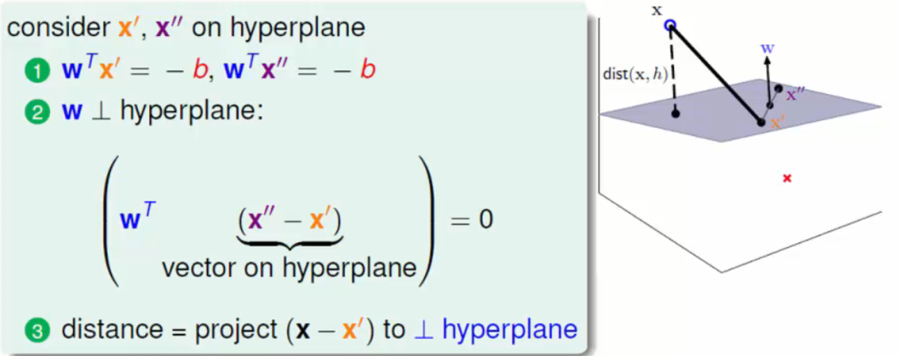

# support vector machines - SVM

## Gist


## Theory

1. ### linear SVM target function

    

    
    > hyperplane is <a href="https://www.codecogs.com/eqnedit.php?latex=W^{T}X^{'}&plus;b=0" target="_blank"></a>

    + #### 支持向量到分类直线的距离(点到直线距离)
        > 参考投影方法

        

        

    + #### 化简 之 距离方程去绝对值

        SVM 考虑二分类问题,将样本类别 Y 设为 {-1, +1}

        设预测值为 
        >  代替 x,意指经过了某种变换

    + #### 带入样本判断所属类别

        &space;0&space;\\&space;&&space;y_{i}=-1,\text{&space;if&space;}&space;y(x_{i})<&space;0&space;\end{cases}&space;\Rightarrow&space;y(i)*y(x_{i})>&space;0" title="\begin{cases} & y_{i}=+1,\text{ if } y(x_{i})> 0 \\ & y_{i}=-1,\text{ if } y(x_{i})< 0 \end{cases} \Rightarrow y(i)*y(x_{i})> 0" />
        > 上式也解释了类别设置为 {-1, +1},而不是常见的 {0, 1}
        >
        > 为了使 **真实类别*预测值 > 0**

    + #### 最终目标方程登场

        找到一条线(w, b),使得离该线最近的点能够最远 ==> 即 **arg max(w,b)** 使得 **min(最近的点到该线的距离)**

        数学表示为

        
        > 此式为  去掉绝对值符号的简单变换(由于的特性)

        最终所求目标即为

        

1. ### 化简

    + #### 对于线(w,b)可通过缩放使得结果值 **|Y|>=1**

        

    + #### 上式令 **=1** 则最终目标函数简化为

         且 
        > 条件是必不可少的 - 使分类正确,若少了这个条件,则引出*软间隔 SVM*

    + #### 转化成求最小值

         且 

1. ### 引入拉格朗日乘子法

    上述为凸优化问题.求解上式常用**拉格朗日乘子法**,其标准形式为

    

    + #### 带入到问题中,原式化为

        

    + #### 通过其对偶问题求解,以简化计算
        > **max min** 相比 **min max** 容易求得

        
        > 原问题的解包含在对偶问题的解中

    + #### 解上式,即对 **w,b** 求偏导

        

        

    + #### 通过上面两个公式,完成了第一步求解

        

    + #### 此时,剩下的任务是求解

        
        > 带入求得的 w,b 即得 L() 新形式.

        若求极大值,可应用最优化方法中的对偶转化成求极小值(公式略).

    _以上即为求解**支持向量**和**分类超平面**的过程._

    _具体问题求解中,首先根据公式求得,之后利用与 w,b 的关系,求得 w,b,即得分类超平面._

1. ### 软间隔 SVM

    

    离群点/异常点 情况下,引入**松弛因子**以放宽条件,提高分类性能.

    则约束条件变为

    

    则目标函数变成了

    

    其中 C 为系数,C 趋近于无穷大时,意味着分类严格不能有错误;C 趋近于很小时,意味着有更大的错误容忍.(C 值自己设定)

    拉格朗日形式为

    

    其求解过程和 hard margin 时类似.

## 回顾


## kernel function


### 使用高斯核函数变换示意


> 

## practice on data mining

```python
from sklearn.svm import SVC, LinearSVC
#{'C':[0.01,0.1,1,10],'gamma':[0.01,0.1,1,10]}
svc = SVC(C=0.88, gamma=0.8)
svc.fit(train_set, test_set)
prediction = svc.predict(verify_set)
```
> Best(Titanic) --> kernel='linear', C=0.025

- g gamma : set gamma in kernel function(default 1/num_features)
- c cost : set the parameter C of C-SVC,epsilon-SVR, and nu-SVR (default 1)

        C是惩罚系数，即对误差的宽容度。c越高，说明越不能容忍出现误差,容易过拟合。C越小，容易欠拟合。C过大或过小，泛化能力变差

        gamma是选择RBF函数作为kernel后，该函数自带的一个参数。隐含地决定了数据映射到新的特征空间后的分布，gamma越大，支持向量越少，gamma值越小，支持向量越多。支持向量的个数影响训练与预测的速度。

之前看《统计学习方法》时候留的粗略的记录,可以找到 [SVM 部分](https://github.com/luanxxys/computer_science/blob/master/machine_learning/%E3%80%8A%E7%BB%9F%E8%AE%A1%E5%AD%A6%E4%B9%A0%E6%96%B9%E6%B3%95%E3%80%8B/readme.md)看看.
