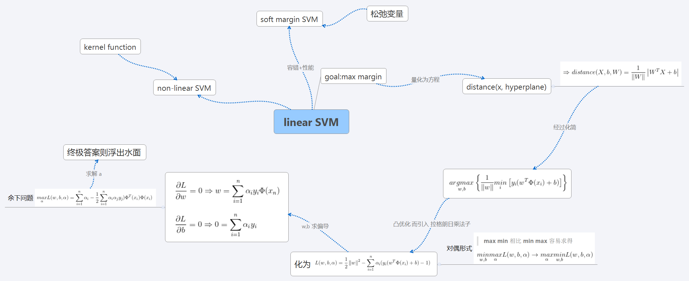
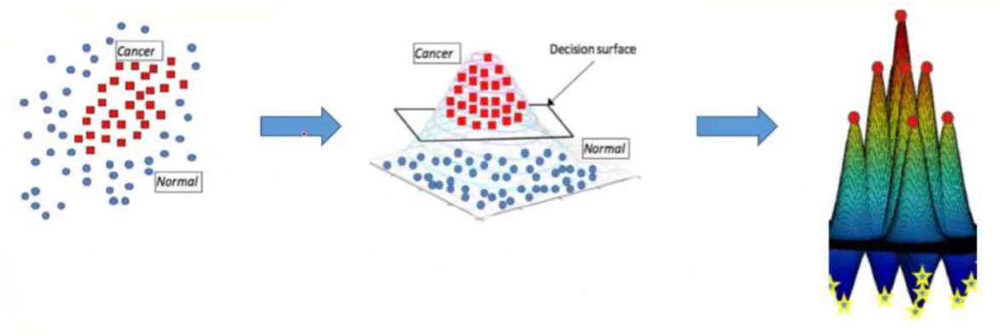

# support vector machines - SVM

## Gist


## Theory

1. ### linear SVM target function

    

    > hyperplane is <a href="https://www.codecogs.com/eqnedit.php?latex=W^{T}X^{'}&plus;b=0" target="_blank"></a>

    + #### 支持向量到分类直线的距离
        > 参考投影方法(点到直线距离)

        

        

        * ##### 函数间隔、几何间隔

            样本类别设置为 {-1, +1}，带入样本判断所属类别

            &space;0&space;\\&space;&&space;y_{i}=-1,\text{&space;if&space;}&space;y(x_{i})<&space;0&space;\end{cases}&space;\Rightarrow&space;y(i)*y(x_{i})>&space;0" title="\begin{cases} & y_{i}=+1,\text{ if } y(x_{i})> 0 \\ & y_{i}=-1,\text{ if } y(x_{i})< 0 \end{cases} \Rightarrow y(i)*y(x_{i})> 0" />

            故  的符号与类标记  的符号是否一致能够表示分类是否正确。所以可用量  来表示分类的正确性和确信度，这就是**函数间隔**(functional margin)的概念。函数间隔为

            

            选择超平面时，成比例改变 w 和 b，超平面没有改变，而函数间隔却会发生变化。故，对法向量 w 加某些约束，如规范化，，使间隔确定 ==> **几何间隔(geometric margin)**。

            即，
            > 若点在超平面负的一侧，则整体 

            当样本点  被超平面正确分类时，点  与超平面距离是

            

            > 样本类别设置为 {-1, +1}，使距离始终为正值

    + #### 下面围绕着求得一个间隔最大的分离超平面进行展开

        **_间隔与分类问题的结构风险有关，最大化间隔等于最小化结构风险，从而得到一个更好的分类器 !_**

        


        

1. ### 化简

    - #### 化为函数间隔形式

        


        

        函数间隔  取值不影响最优化问题的解，可令 

        > w,b 按比例改变为 ，这时函数间隔为 ，故并无影响

    + #### 去绝对值

        

    + #### 最终目标函数登场

        


        

        > 条件是必不可少的 - 表达意思等价于:为了使得所有样本数据都在间隔区(两条虚线)以外。否则，引出*soft hard SVM* (容错)

1. ### 引入拉格朗日乘子法

    上述为凸优化问题。常用**拉格朗日乘子法(Method of lagrange multiplier)**，它用来求解在约束条件目标函数的极值。其标准形式为

    

    + #### 带入到目标函数中

        引入 n 个拉格朗日乘法子(因为有 n 个约束),记为

        

        >  代替 x,意指经过了某种变换

        解这个拉格朗日方程,即对 **w,b** 求偏导,得

        

        

        通过上面两个公式,完成了第一步求解

        

        将上面两个条件带回,进行下一步的计算。

    + #### 通过其对偶问题求解,以简化计算

        > 原问题的解包含在对偶问题的解中，等价最优化。转换为对偶问题能得到更高效的解法，也方便了核函数的引入。

        为什么支持向量机要用拉格朗日对偶算法来解最大化间隔问题？

            1) 不等式约束一直是优化问题中的难题，求解对偶问题可以将支持向量机原问题约束中的不等式约束转化为等式约束；
            2) 支持向量机中用到了高维映射，但是映射函数的具体形式几乎完全不可确定，而求解对偶问题之后，可以使用核函数来解决这个问题。

        > 用拉格朗日对偶并没有改变最优解，而是改变了算法复杂度

        在当前情境下

        

        转化为对偶形式,则目标函数变为最大化

    + #### 即,对偶形式后的任务是求解

        

        

    + #### 最终模型

        以上表达式通过**二次规划**算法解出后,带回,求出 w 和 b,即可得到模型

        

    _以上即为求解**支持向量**和**分类超平面**的过程._

    _具体问题求解中,首先根据公式求得,之后利用与 w,b 的关系,求得 w,b,即得分类超平面._

1. ### 软间隔 SVM

    

    离群点/异常点 情况下,引入**松弛因子 ** (slack variables)以放宽条件,提高分类性能。

    则约束条件变为

    

    则目标函数变成了

    

    > 其中 C 为系数,C 趋近于无穷大时,意味着分类严格不能有错误;C 趋近于很小时,意味着有更大的错误容忍(C 值自己设定)

    拉格朗日形式为

    

    其求解过程和 hard margin 时类似.

## 回顾上述求解过程



## non-linear SVM

### kernel function


### 使用高斯核函数变换示意



- 常见核函数

    

## 多类问题

多类问题可以使用两两做支持向量机，再由所有支持向量机投票选出这个类别的归属。即 *one-versus-one approace*.

## practice on data mining

```python
from sklearn.svm import SVC, LinearSVC
#{'C':[0.01,0.1,1,10],'gamma':[0.01,0.1,1,10]}
svc = SVC(C=0.88, gamma=0.8)
svc.fit(train_set, test_set)
prediction = svc.predict(verify_set)
```
> Best(Titanic) --> kernel='linear', C=0.025

- g gamma : set gamma in kernel function(default 1/num_features)
- c cost : set the parameter C of C-SVC,epsilon-SVR, and nu-SVR (default 1)

        C是惩罚系数，即对误差的宽容度。
        c越高，说明越不能容忍出现误差,容易过拟合。C越小，容易欠拟合。
        C过大或过小，泛化能力变差

        gamma是选择RBF函数作为kernel后，该函数自带的一个参数。
        隐含地决定了数据映射到新的特征空间后的分布，gamma越大，支持向量越少，gamma值越小，支持向量越多。
        支持向量的个数影响训练与预测的速度。

之前看《统计学习方法》时候留的粗略的记录,可以找到 [SVM 部分](https://github.com/luanxxys/computer_science/blob/master/machine_learning/%E3%80%8A%E7%BB%9F%E8%AE%A1%E5%AD%A6%E4%B9%A0%E6%96%B9%E6%B3%95%E3%80%8B/readme.md)看看.
