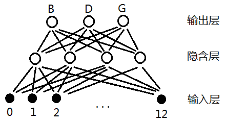
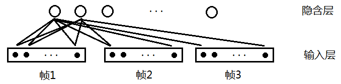
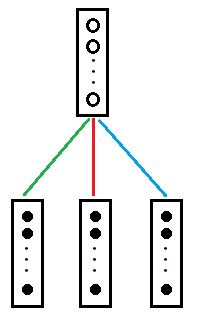
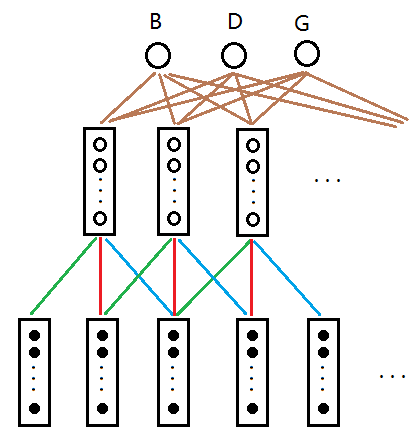
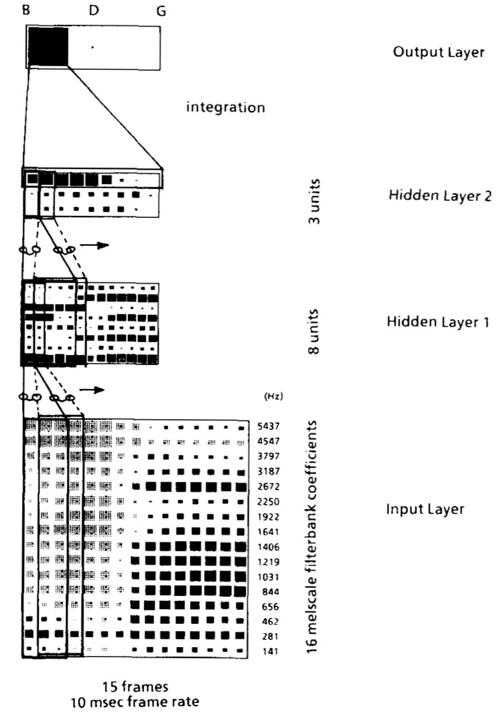

# Time Delay Neural Networks

TDNN 被 Hinton 组于 1989 年提出用于解决语音识别问题，最初专注于音素检测。

传统的深度神经网络的输入层与隐含层一一连接，而 TDNN 隐含层的特征不仅与当前时刻的输入有关，而且还与未来时刻的输入有关。

说话的声音很少有一致的长度，通过检查过去和未来的声音，TDNN 能够构建一个时间不变的声音模型。

而且其结构参数较少，进行语音识别不需要预先将音标与音频在时间线上进行对齐，实验证明 TDNN 相比 HMM 表现更好。

综上，TDNN 的两个明显的特征

- 动态适应时域特征变化
- 参数较少

- ## 网络结构

    + ### 从神经网络识别音素讲起

        * #### 对于一般神经网络

            假设要识别三个辅音 "B", "D", "G"

            

            > 其中输入 0-12 代表每一帧的特征向量（如 13 维 MFCC 特征）

            即使在同一个音素 "B" 中（比如 "B" 包含 20 帧），那么第 1 帧与第 15 帧的 MFCC 特征也可能不一样。这个模型合理吗？

            事实上，"B" 包含的 20 帧 MFCC 特征虽然有可能不一样，但变化不会太大，对于音素还是有一定区分度的，也就是说这个模型凑合凑合还能用，但效果不会非常好。GMM 模型可以用这种模型来解释。

        * #### 对于 TDNN

            设计一个包含多帧的神经网络。其中隐含层起到特征抽取的作用，输入层每一个矩形内有 13 个小黑点，代表该帧的 13 维 MFCC 特征。假设有 10 个隐含层，那么连接的权重数目为 3* 13 * 10=390

            
            > 延时为 2，则连续的 3 帧都会被考虑

            为了结构紧凑显示，我们将其重绘

            

            > 每条彩色线代表 13*10=130 个权重值。三条彩色线为 390 个权重。也有资料称之为滤波器。

            随时间推进，我们不断地对语音帧使用滤波器

            

            相同颜色的线权值相同（权重共享，即相同的时延位置的权重是共享的）。相当于把滤波器延时。输入与隐层共 390 个权值变量待确定。

            每个隐层矩形内包含 10 个节点，那么每条棕色的线包含 10 个权值，假设输出层与隐层的延时为 4，则接收 5 个隐层矩形内的数据，那么隐层与输出层合计权值为 10 * 5 * 3=150.权值非常少，所以便于训练。

            然后理解 TDNN 原始论文[Phoneme recognition using time-delay neural networks](waibel_TDNN.pdf)中的网络。思想与上文一样，不过文章多用了一层隐层（多隐层有更强的特征提取和抽象能力）。

            

            > Input Layer 为语谱图，黑块为大值，灰块为小值。输入层纵向为经过 mel 滤波器的 16 个特征（没用 MFCC），横向为帧。Input Layer 的延时为 2，映射到 Hidden Layer 1 的关系为 16 * 3 --> 8，权值个数为 384。Hidden Layer 1 的延时为 4，映射到 Hidden Layer 2 的关系为 8 * 5 --> 3，权值个数为 120。Hidden Layer 2 的延时为 8，映射到输出层的关系为 3 * 9 --> 3，权值个数为 81.合计权值为 384+120+81=585.输出的三个单元分别代表 "B", "D", "G" 的概率分布。

- ## 优点

    + 网络是多层的，每层对特征有较强的抽象能力
    + 有能力表达语音特征在时间上的关系
    + 具有时间不变性
    + 学习过程中不要求对所学的标记进行精确的时间定为
    + 通过共享权值，方便学习

- ## Tensorflow 实现

    ```python
    import tensorflow as tf
    import numpy as np

    tf.set_random_seed(922)
    np.random.seed(0)

    def tdnn(inp, n_class):
        h1_kernel_size = 3
        h1_filters = 8
        h1 = tf.layers.conv1d(inp, h1_filters, h1_kernel_size)
        h2_kernel_size = 5
        h2_filters = n_class
        h2 = tf.layers.conv1d(h1, h2_filters, h2_kernel_size)
        h2 = tf.transpose(h2, [ 0, 2, 1])
        output = tf.squeeze(tf.layers.dense(h2, 1, tf.sigmoid))

        return output

    if __name__ == '__main__':
        bs = 1
        n_frame = 15
        n_feature = 16
        n_class = 3
        inp=tf.placeholder(tf.float32, shape=[bs, n_frame, n_feature])
        output = tdnn(inp, n_class)

        with tf.Session() as sess:
            i = np.random.normal(size=(bs, n_frame, n_feature))
            sess.run(tf.global_variables_initializer())
            o = sess.run(output, feed_dict={inp: i})

            print(np.array(o).shape) # (3,)
            print(np.array(o)) # [0.64834243 0.91836888 0.50499392]
    ```

- ## reference

    + [TDNN 时延神经网络](https://blog.csdn.net/richard2357/article/details/16896837)
    + [时延神经网络 (TDNN) 原理及其 TensorFlow 实现](http://www.sohu.com/a/141935381_723464)
