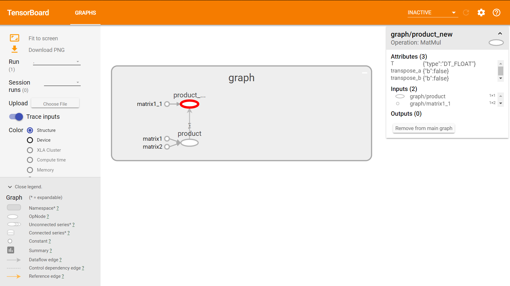
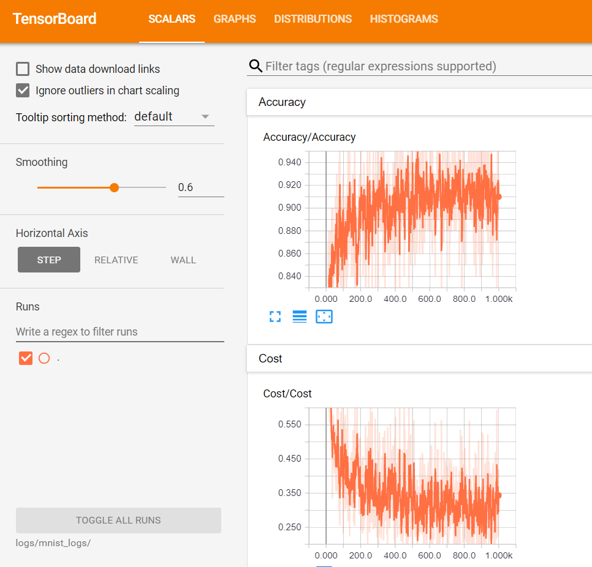
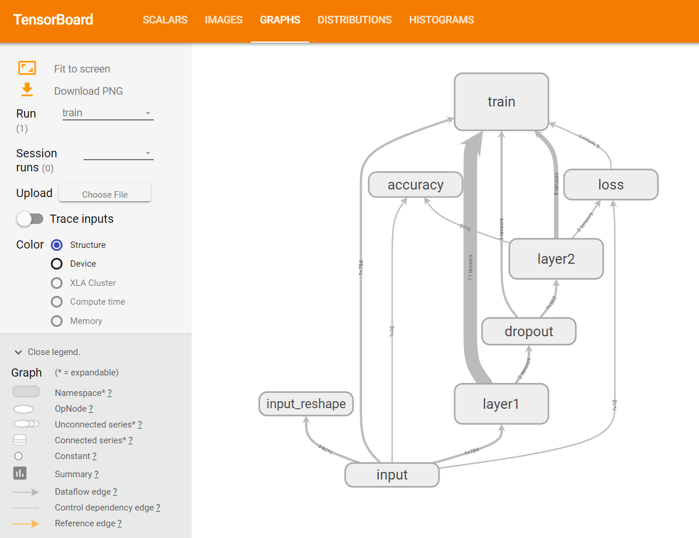

# TensorBoard: 可视化学习

> 为了更方便 TensorFlow 程序的理解、调试与优化，我们发布了一套叫做 TensorBoard 的可视化工具。你可以用 TensorBoard 来展现你的 TensorFlow 图像，绘制图像生成的定量指标图以及附加数据。

## example 1

- `vim add.py`

```python
import tensorflow as tf

with tf.name_scope('graph') as scope:
    matrix1 = tf.constant([[3., 3.]],name ='matrix1')  #1 row by 2 column
    matrix2 = tf.constant([[2.],[2.]],name ='matrix2') # 2 row by 1 column
    matrix3 = tf.constant([[1., 3.]],name ='matrix1')
    product = tf.matmul(matrix1, matrix2,name='product')
    product = tf.matmul(product, matrix3,name='product_new')

sess = tf.Session()

# 定义一个summary, 其中指定相关文件存储路径
writer = tf.summary.FileWriter("log/", sess.graph)

init = tf.global_variables_initializer()
sess.run(init)
```

- 运行程序, 生成事件文件

        `python add.py`

- 启动 TensorBoard

        tensorboard --logdir=/path/to/log-directory

- 在浏览器中查看

    输入 `localhost:6006`

    展示图

    

## example 2

- `vim [mnist.py](mnist.py)`

- `python mnist.py`

- `tensorboard --logdir=/logs/mnist --port 6005`

展示图





## 数据序列化

TensorBoard 通过读取 TensorFlow 的事件文件来运行。TensorFlow 的事件文件包括了你会在 TensorFlow 运行中涉及到的主要数据。

- scalar_summary

    你可能希望记录学习速度 (learning rate) 的如何变化，以及目标函数如何变化。通过向节点附加 scalar_summary 操作来分别输出学习速度和期望误差。

- histogram_summary

    希望显示一个特殊层中激活的分布，或者梯度权重的分布。可以通过分别附加 histogram_summary 运算来收集权重变量和梯度输出。

- tf.merge_all_summaries

    在 TensorFlow 中，所有的操作只有当你执行，或者另一个操作依赖于它的输出时才会运行。我们刚才创建的这些节点（summary nodes）都围绕着你的图像：没有任何操作依赖于它们的结果。因此，为了生成汇总信息，我们需要运行所有这些节点。这样的手动工作是很乏味的，因此可以使用 tf.merge_all_summaries 来将他们合并为一个操作。

- tf.train.Summarywriter

    然后你可以执行合并命令，它会依据特点步骤将所有数据生成一个序列化的Summary protobuf 对象。最后，为了将汇总数据写入磁盘，需要将汇总的 protobuf 对象传递给 tf.train.Summarywriter。

[TensorBoard: 可视化学习](http://wiki.jikexueyuan.com/project/tensorflow-zh/how_tos/summaries_and_tensorboard.html)

[TensorBoard: 图表可视化](http://wiki.jikexueyuan.com/project/tensorflow-zh/how_tos/graph_viz.html)
