### Gist

- What can GAN do ?
- What is GAN ?
- Theory & Algorithm
- PROs and CONs
- There are more that GAN can do ...
- Future Research on GANs
- GAN on Speech Processing

# Generative Adversarial Networks

### What can GAN do ?

> Taigman et al., 2017

> Alec Radford  et al. 2015

> genekogan@Twitter

> R. Huang et al. 2017

> Jun-Yan Zhu et al. 2016

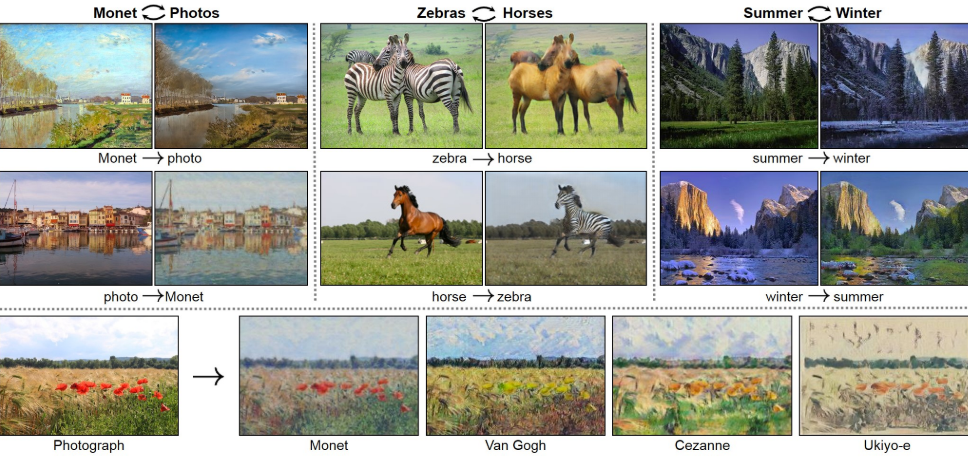

> https://junyanz.github.io/CycleGAN/

### What is GAN ?

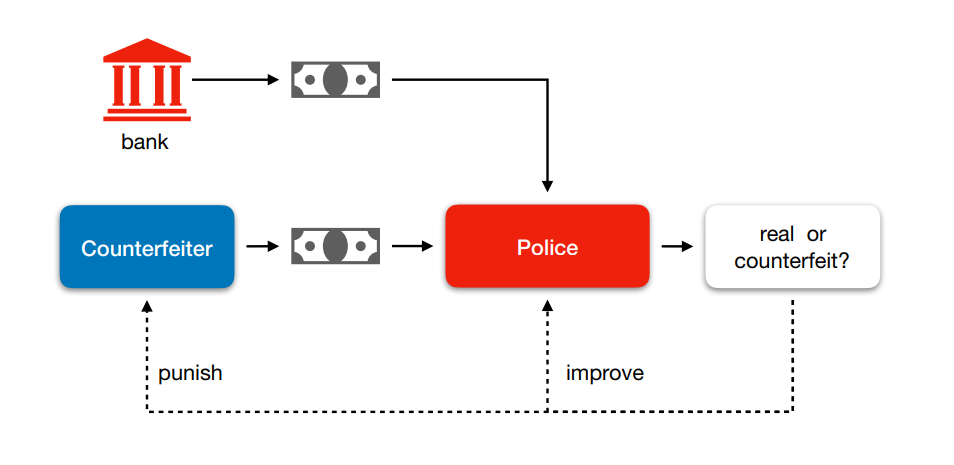

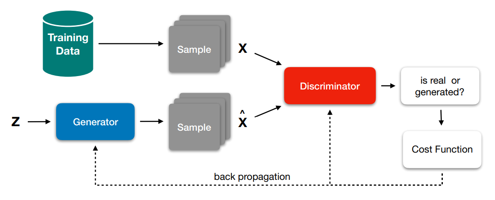

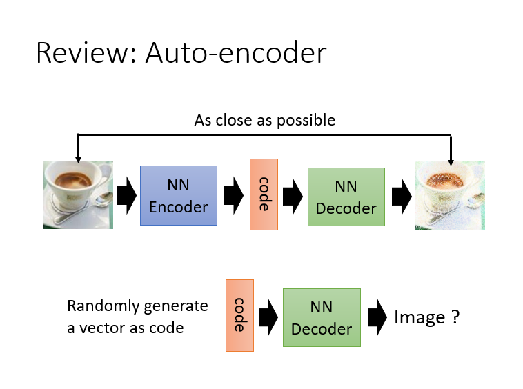

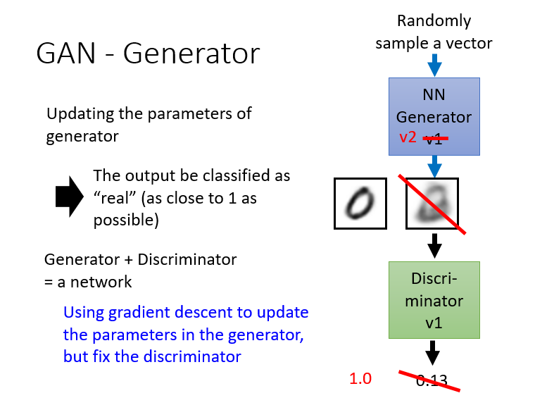

Generator Model

- Deep Belief Network (DBN)

- Stacked Auto-Encoder (SAE)

- Deep Boltzman Machine (DBM)

- Variational Auto-Encoder (VAE)

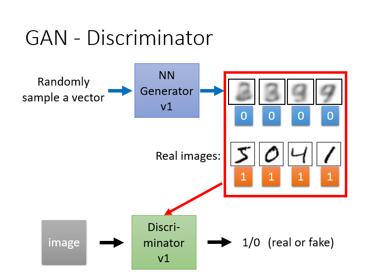

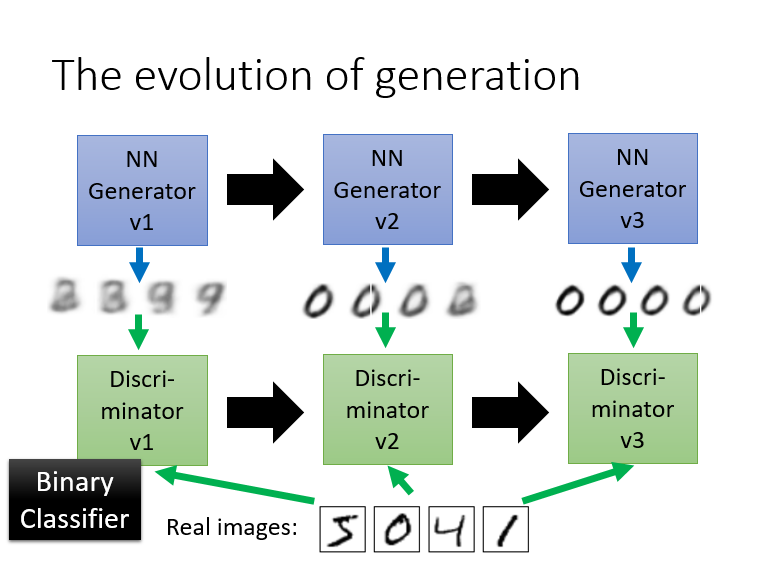

Demo - Generate cartoon faces

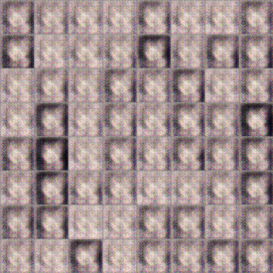

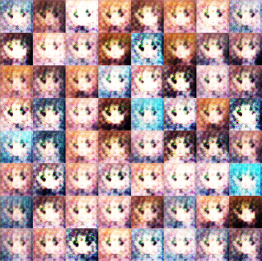

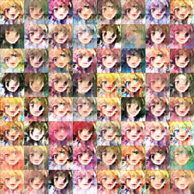

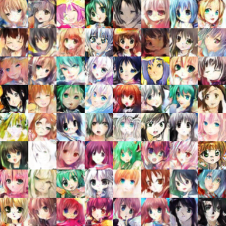

> [DCGAN](https://github.com/carpedm20/DCGAN-tensorflow)

### Theory & Algorithm

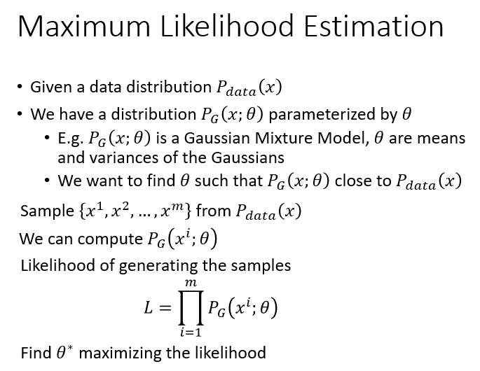

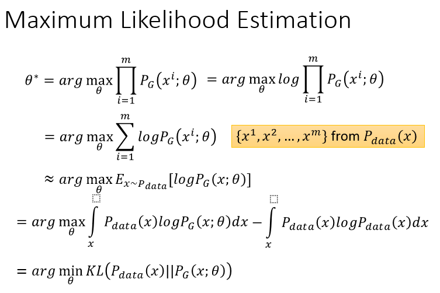

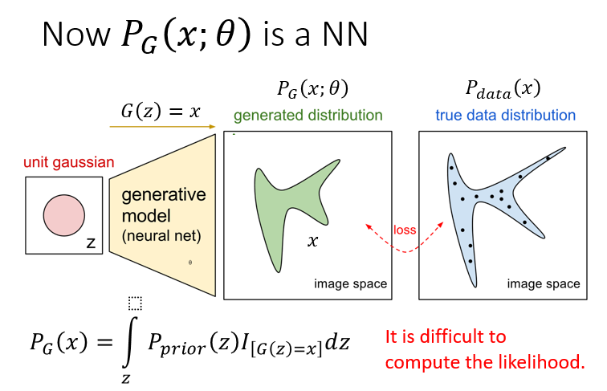

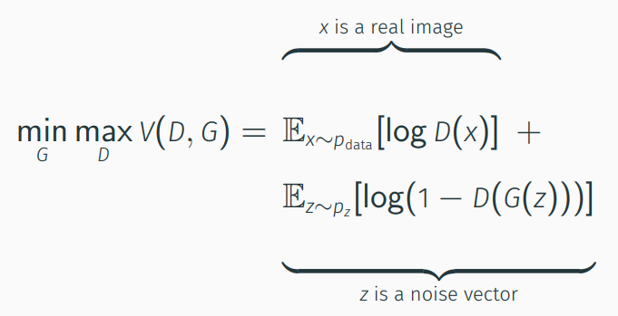

The optimization process is a Minimax game problem, and the optimization goal is to achieve the Nash equilibrium

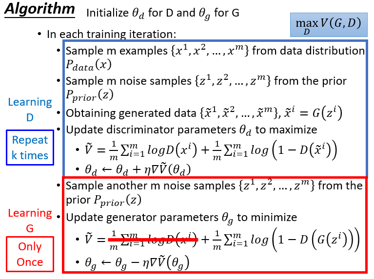

[GAN Math](https://sherlockliao.github.io/2017/06/20/gan_math/)

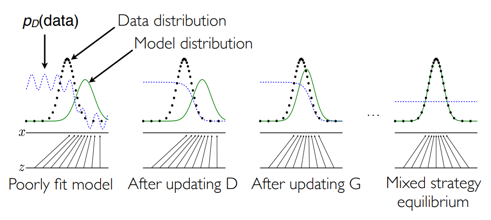

### PROs and CONs

PROs

- Markov chains are never needed

        only backprop is used to obtain gradients

- No inference is needed during learning

- A wide variety of functions can be incorporated into the model

- GAN can be combined with CNN and RNN

CONs

- There is no explicit representation of Pg(x)

- D must be synchronized well with G during training

### [Head First Generative Adversarial Networks](HeadFirstGAN_theory.pdf)

### There are more that GAN can do ...

[Generative Adversarial Nets](http://papers.nips.cc/paper/5423-generative-adversarial-nets)

> Ian Goodfellow et al., 2014

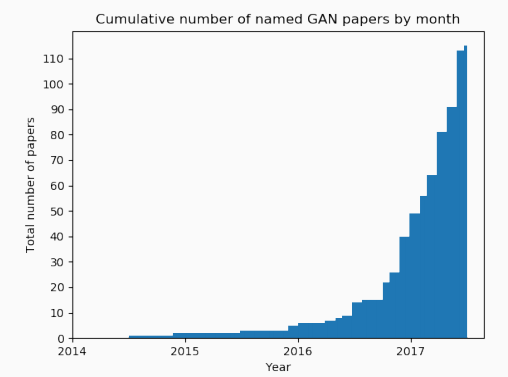

> github.com/hindupuravinash/the-gan-zoo as at June 10, 2017

Kinds of GANs

[GAN Timeline](https://github.com/dongb5/GAN-Timeline)

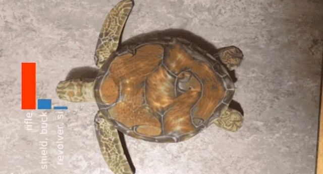

Text to Image

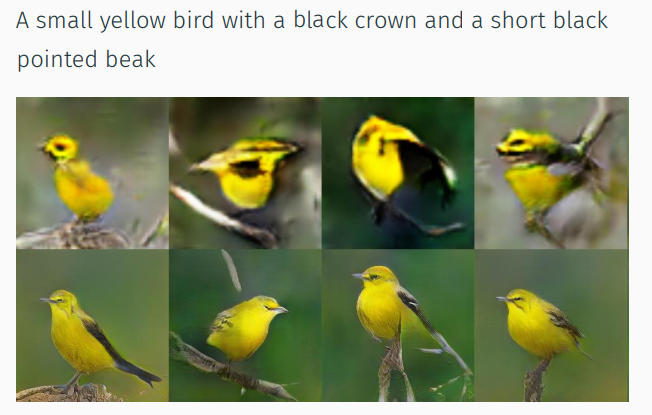

> H. Zhang et al. 2016 (StackGAN)

Image to Image

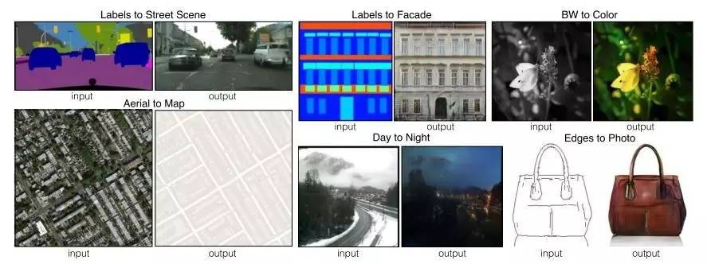

Single Image Super-Resolution

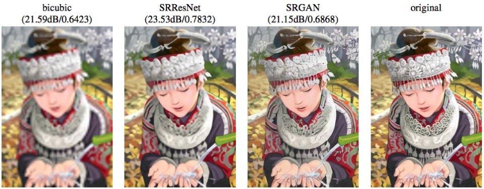

> Christian Ledig et al. 2016

### Future Research on GANs

### GAN on Speech Processing

[Robust Speech Recognition Using Generative Adversarial Networks](https://arxiv.org/abs/1711.01567)

[SEGAN: Speech Enhancement Generative Adversarial Network](https://arxiv.org/pdf/1703.09452.pdf)

- [Exploring Speech Enhancement with Generative Adversarial Networks for Robust Speech Recognition](https://arxiv.org/abs/1711.05747)

- [Conditional Generative Adversarial Networks for Speech Enhancement and Noise-Robust Speaker Verification](http://kom.aau.dk/~zt/doc/Michelsanti-Tan-cGAN-Interspeech2017.pdf)

- [Statistical Parametric Speech Synthesis Using Generative Adversarial Networks Under A Multi-task Learning Framework](https://arxiv.org/abs/1707.01670)

- [Statistical Parametric Speech Synthesis Incorporating Generative Adversarial Networks](https://arxiv.org/abs/1709.08041)
