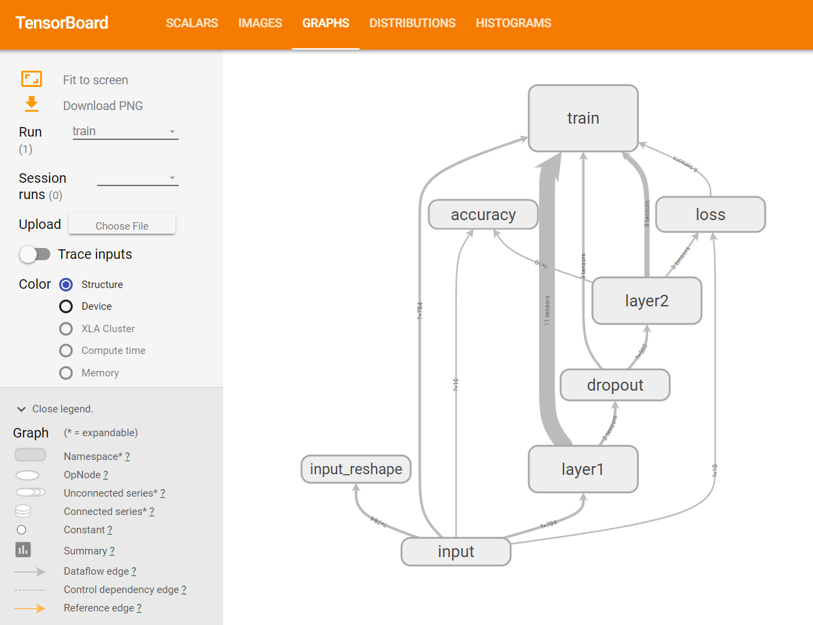

# TensorBoard: 可视化学习

> 为了更方便 TensorFlow 程序的理解、调试与优化，我们发布了一套叫做 TensorBoard 的可视化工具. 你可以用 TensorBoard 来展现你的 TensorFlow 图像，绘制图像生成的定量指标图以及附加数据.

Tensorboard 可以将模型训练过程中的各种数据汇总起来存在自定义的路径与日志文件中，然后在指定的 web 端可视化地展现这些信息.

### Tensorboard 可以记录与展示以下数据形式

- 标量 Scalars
- 图片 Images
- 音频 Audio
- 计算图 Graph
- 数据分布 Distribution
- 直方图 Histograms
- 嵌入向量 Embeddings

### Tensorboard 的可视化过程

- 先建立一个 graph, 定义想从这个 graph 中获取的数据的信息.

- 确定要在 graph 中的哪些节点放置 summary operations 以记录信息.

        使用 tf.summary.scalar 记录标量
        使用 tf.summary.histogram 记录数据的直方图
        使用 tf.summary.distribution 记录数据的分布图
        使用 tf.summary.image 记录图像数据
        …

- operations 并不会去真的执行计算，除非你告诉他们需要去 run, 或者它被其他的需要 run 的 operation 所依赖. 而我们上一步创建的这些 summary operations 其实并不被其他节点依赖，因此，我们需要特地去运行所有的 summary 节点. 使用 `tf.summary.merge_all` 去将所有 summary 节点合并成一个节点，只要运行这个节点，就能产生所有我们之前设置的 summary data.

- 使用 `tf.summary.FileWriter` 将运行后输出的数据都保存到本地磁盘中.

- 运行整个程序，并在命令行输入运行 tensorboard 的指令，之后打开 web 端可查看可视化的结果.

## example - MNIST

- `vim mnist.py`

    [view code](mnist.py)

- 运行程序, 生成事件文件

        `python mnist.py`

- 启动 TensorBoard

        tensorboard --logdir=logs/mnist_logs

- 在浏览器中查看

    输入 `localhost:6006`

    展示图

    

## 数据序列化

TensorBoard 通过读取 TensorFlow 的事件文件来运行. TensorFlow 的事件文件包括了你会在 TensorFlow 运行中涉及到的主要数据.

- tf.summary.scalar

    你可能希望记录学习速度 (learning rate) 的如何变化，以及目标函数如何变化. 通过向节点附加 `tf.summary.scalar` 操作来分别输出学习速度和期望误差.

- tf.summary.histogram

    希望显示一个特殊层中激活的分布，或者梯度权重的分布. 可以通过分别附加 `tf.summary.histogram` 运算来收集权重变量和梯度输出.

- tf.summary.merge_all

    在 TensorFlow 中，所有的操作只有当你执行，或者另一个操作依赖于它的输出时才会运行. 我们刚才创建的这些节点（summary nodes）都围绕着你的图像：没有任何操作依赖于它们的结果. 因此，为了生成汇总信息，我们需要运行所有这些节点. 这样的手动工作是很乏味的，因此可以使用 `tf.summary.merge_all` 来将他们合并为一个操作.

- tf.summary.FileWriter

    然后你可以执行合并命令，它会依据特点步骤将所有数据生成一个序列化的Summary protobuf 对象. 最后，为了将汇总数据写入磁盘，需要将汇总的 protobuf 对象传递给 `tf.summary.FileWriter`.

### reference

- [TensorBoard: 可视化学习](http://wiki.jikexueyuan.com/project/tensorflow-zh/how_tos/summaries_and_tensorboard.html)

- [TensorBoard: 图表可视化](http://wiki.jikexueyuan.com/project/tensorflow-zh/how_tos/graph_viz.html)

- [Tensorboard 的初步使用](https://blog.csdn.net/sinat_33761963/article/details/62433234)
