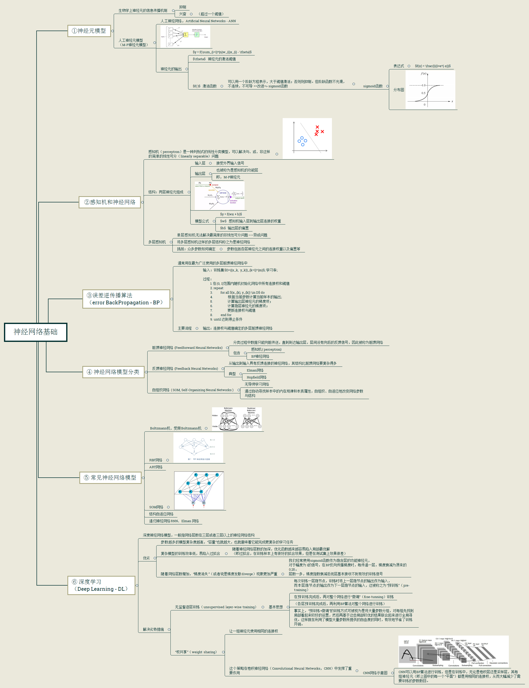
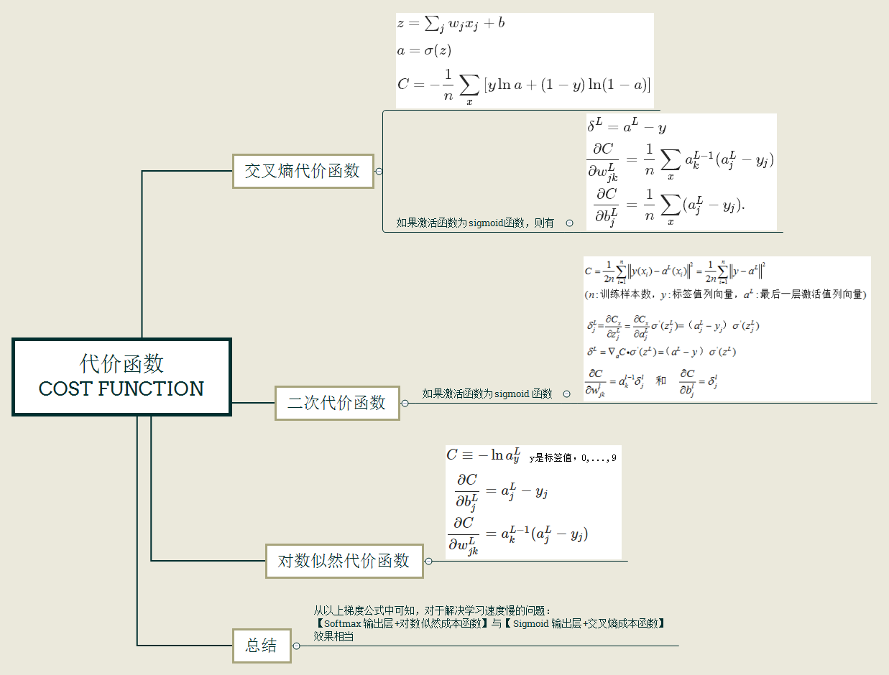
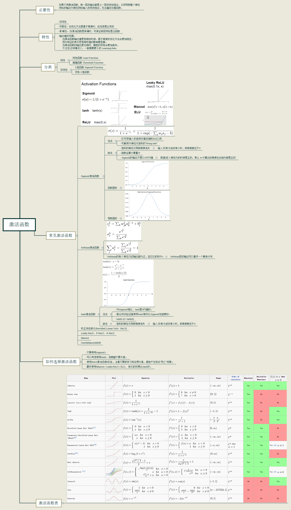
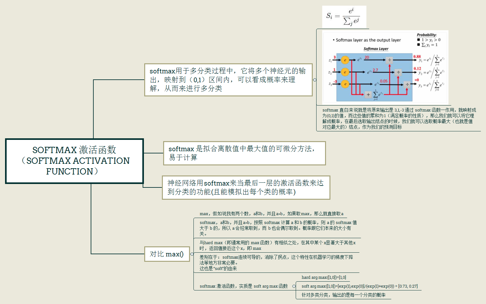

# Basic concepts of machine learning

- 神经网络基础

- 代价函数

- 激活函数

    + Softmax 激活函数

> [Machine Learning & Algorithm 神经网络基础](https://www.cnblogs.com/maybe2030/p/5597716.html)

> [Activation function reference](http://blog.csdn.net/myarrow/article/details/51396654)

