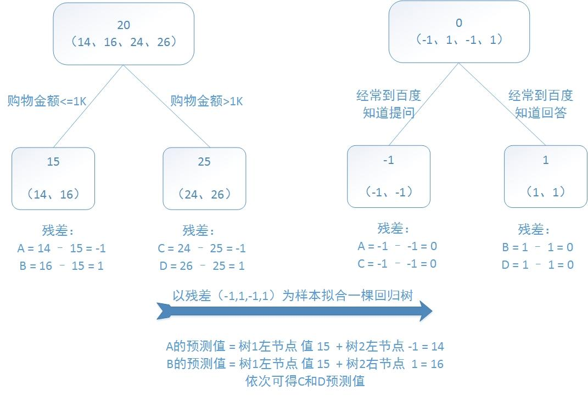
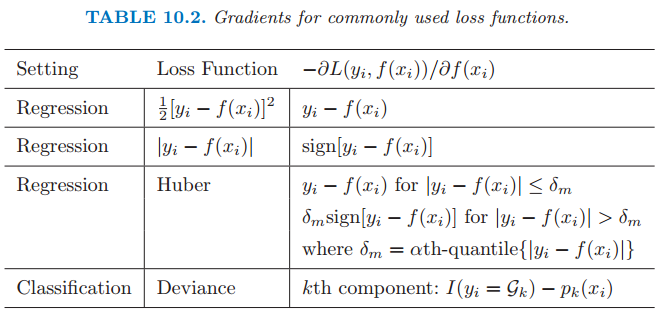
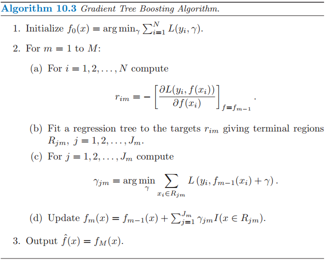

# GBDT - Gradient Boosting Decision Tree

GBDT 又叫 MART（Multiple Additive Regression Tree)，是一种迭代的决策树算法，该算法由多棵决策树组成，所有树的结论累加起来做最终答案。它在被提出之初就和 SVM 一起被认为是泛化能力较强的算法。

GBDT 中的树是回归树（不是分类树），GBDT 用来做回归预测，调整后也可以用于分类。

 GBDT 的思想使其具有天然优势可以发现多种有区分性的特征以及特征组合。

- ## Regression Decision Tree

    回归树总体流程类似于分类树，区别在于，回归树的每一个节点都会得一个预测值

    分枝时穷举每一个 feature 的每个阈值找最好的分割点

    衡量标准是最小化平方误差,通过最小化平方误差能够找到最可靠的分枝依据。

    分枝直到每个叶子节点上人的年龄都唯一或者达到预设的终止条件 (如叶子个数上限)，若最终叶子节点上人的年龄不唯一，则以该节点上所有人的平均年龄做为该叶子节点的预测年龄。

    

- ## Boosting Decision Tree

    提升树是迭代多棵回归树来共同决策。当采用平方误差损失函数时，每一棵回归树学习的是之前所有树的结论和残差，拟合得到一个当前的残差回归树，残差的意义如公式：残差 = 真实值 - 预测值 。提升树即是整个迭代过程生成的回归树的累加。

    训练一个提升树模型来预测年龄：
  
    训练集是 4 个人，A，B，C，D 年龄分别是 14，16，24，26。样本中有购物金额、上网时长、经常到百度知道提问等特征。提升树的过程如下：

    

    > 该例子很直观的能看到，预测值等于所有树值得累加，如 A 的预测值 = 树 1 左节点 值 15 + 树 2 左节点 -1 = 14

    因此，给定当前模型 fm-1(x)，只需要简单的拟合当前模型的残差。现将回归问题的提升树算法叙述如下

    

- ## Gradient Boosting Decision Tree

    当损失函数是平方损失、指数损失函数时，每一步的优化很简单，如平方损失函数学习残差回归树。

    

    但对于一般的损失函数，往往每一步优化没那么容易，如上图中的绝对值损失函数和 Huber 损失函数。

    针对这一问题，Freidman 提出了梯度提升算法：利用最速下降的近似方法，即利用损失函数的负梯度在当前模型的值，作为回归问题中提升树算法的残差的近似值，拟合一个回归树。

    

    算法步骤解释：

        1、初始化，估计使损失函数极小化的常数值，它是只有一个根节点的树，即 ganma 是一个常数值。
        2、
        （a）计算损失函数的负梯度在当前模型的值，将它作为残差的估计
        （b）估计回归树叶节点区域，以拟合残差的近似值
        （c）利用线性搜索估计叶节点区域的值，使损失函数极小化
        （d）更新回归树
        3、得到输出的最终模型 f(x)

- ## 重要参数的意义及设置

    GBDT 树的深度：6

       横向比较：DecisionTree/RandomForest 需要把树的深度调到 15 或更高

    > xgboost/gbdt 在调参时为什么树的深度很少就能达到很高的精度？

       一句话的解释，来自周志华老师的机器学习教科书（ 机器学习 - 周志华）：

           Boosting 主要关注降低偏差，因此 Boosting 能基于泛化性能相当弱的学习器构建出很强的集成；Bagging 主要关注降低方差，因此它在不剪枝的决策树、神经网络等学习器上效用更为明显。

       随机森林 (random forest) 和 GBDT 都是属于集成学习（ensemble learning) 的范畴。集成学习下有两个重要的策略 Bagging 和 Boosting。

       Bagging 算法是这样做的：每个分类器都随机从原样本中做有放回的采样，然后分别在这些采样后的样本上训练分类器，然后再把这些分类器组合起来。简单的多数投票一般就可以。其代表算法是随机森林。
       Boosting 的意思是这样，他通过迭代地训练一系列的分类器，每个分类器采用的样本分布都和上一轮的学习结果有关。其代表算法是 AdaBoost, GBDT。

       就机器学习算法来说，其泛化误差可以分解为两部分，偏差（bias) 和方差 (variance)。
       偏差指的是算法的期望预测与真实预测之间的偏差程度，反应了模型本身的拟合能力；
       方差度量了同等大小的训练集的变动导致学习性能的变化，刻画了数据扰动所导致的影响。

       
       > 当模型越复杂时，拟合的程度就越高，模型的训练偏差就越小。但此时如果换一组数据可能模型的变化就会很大，即模型的方差很大。所以模型过于复杂的时候会导致过拟合。当模型越简单时，即使我们再换一组数据，最后得出的学习器和之前的学习器的差别就不那么大，模型的方差很小。还是因为模型简单，所以偏差会很大。

       也就是说，当我们训练一个模型时，偏差和方差都得照顾到，漏掉一个都不行。
       对于 Bagging 算法来说，由于我们会并行地训练很多不同的分类器的目的就是降低这个方差 (variance) , 因为采用了相互独立的基分类器多了以后，h 的值自然就会靠近. 所以对于每个基分类器来说，目标就是如何降低这个偏差（bias), 所以我们会采用深度很深甚至不剪枝的决策树。
       对于 Boosting 来说，每一步我们都会在上一轮的基础上更加拟合原数据，所以可以保证偏差（bias）, 所以对于每个基分类器来说，问题就在于如何选择 variance 更小的分类器，即更简单的分类器，所以我们选择了深度很浅的决策树。

       用 RandomForest 所需要的树的深度和 DecisionTree 一样我能理解，因为它是用 bagging 的方法把 DecisionTree 组合在一起，相当于做了多次 DecisionTree 一样。

- ## xgboost

    最近引起关注的一个 Gradient Boosting 算法：xgboost，在计算速度和准确率上，较 GBDT 有明显的提升。最大的特点在于，它能够自动利用 CPU 的多线程进行并行，同时在算法上加以改进提高了精度。

[GBDT：梯度提升决策树](https://www.jianshu.com/p/005a4e6ac775)
