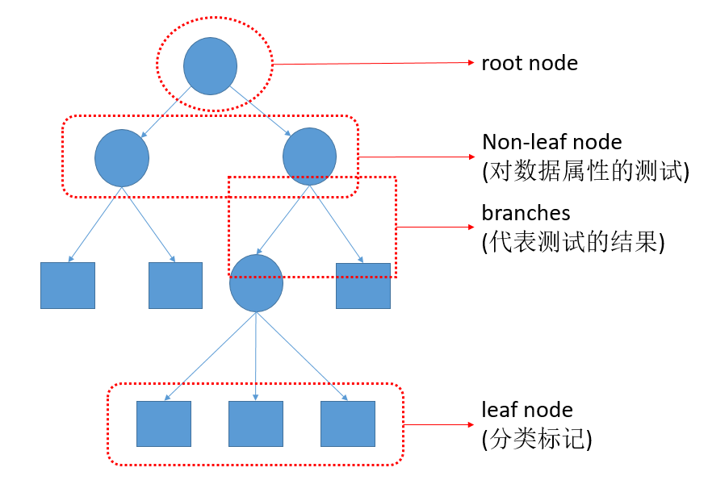
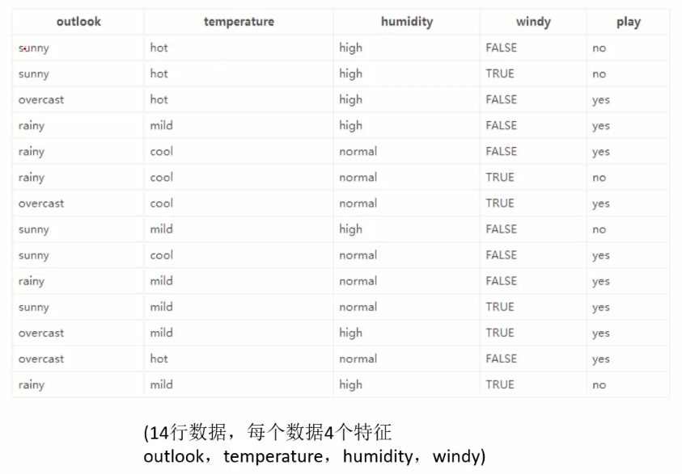
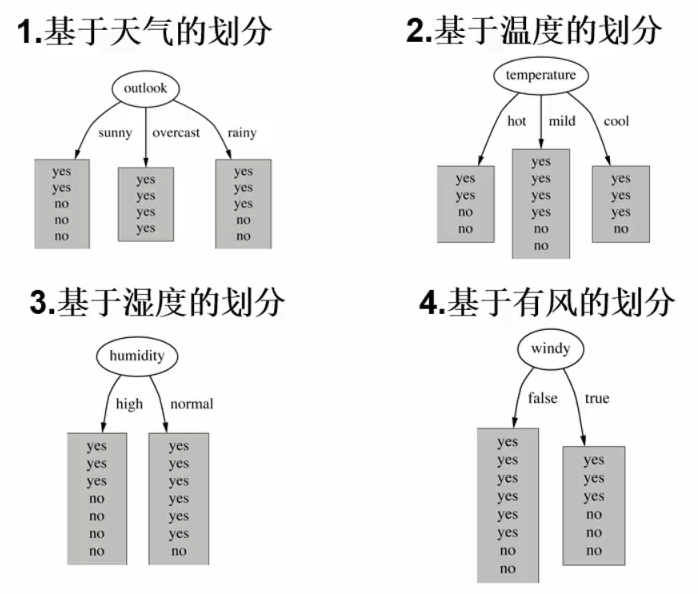
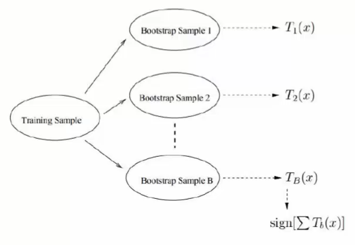
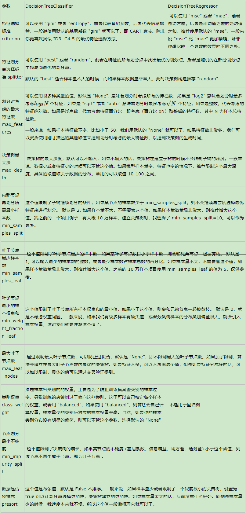

# Decision Tree and Random Forest

- ## 基本概念

    可用于分类、回归

    决策树算法以树状结构表示数据分类的结果。每个决策点实现一个具有离散输出的测试函数，记为分支。

    

- ## 决策树生成

    + ### 学习过程

        1. 训练阶段

            从给定的训练数据集 DB 中，构造出决策树。

            

        1. 分类阶段

            从根开始，按照决策树的分类属性逐层往下划分，直到叶节点，获得概念（决策、分类）结果。

            

    + ### 特征选择

        * 熵(entropy)

            X 和 Y 两个事件相互独立，即 P(X,Y)=P(X)*P(Y)

            H(X), H(Y) 表示它们发生的不确定性，则 P(X) 越大，H(X) 越小

            

        * 构造树的基本想法

            **节点的熵迅速地降低。熵降低的速度越快越好，这样我们有望得到一颗高度最矮的决策树。**

        * 示例：天气和是否出去玩

            - 数据集为

                

            - 决策划分方式

                

            - 未指定天气状况情况下，根据历史数据，求熵

                

            - 对候选的节点遍历尝试求信息增益，以决定哪个变量作树的根节点

                > 以 outlook 变量为例

                当根节点为 outlook 时，进行划分，此时

                + outlook=sunny 时，entropy=0.971
                + outlook=overcast 时，entropy=0
                + outlook=rainy 时，entropy=0.971

                根据历史统计信息，outlook 取值为 sunny、overcast、rainy 概率分别为 5/14、4/14、5/14，所以当已知变量 outlook 的值时，信息熵为

                

                这样的话，系统熵从 0.940 降到了 0.693，信息增益为

                

                同理求得其它变量的增益，gain(outlook)最大（在第一步使系统的信息熵下降得最快），则决策树的根节点取 outlook.

            - 依此类推，构造决策树

                当系统的信息熵将为零时，不必再往下构造决策树，此时叶子节点都是纯的。

                上述是理想情况。最坏的情况下，决策树的高度为属性（决策变量）得个数，叶子节点不纯（意味着要以一定的概率作出决策）。

- ## 生成决策树算法

    + ### ID3

        - 算法核心

            在决策树的各个节点上应用信息增益准则选择特征，递归构建决策树。

        - 具体方法如上示例。

    + ### C4.5

        样本中某个特征的属性很多，每个属性对应的样本又很少。这时这个特征会产生大的信息增益，但意义不大。

        - 对 ID3 算法进行改进，生成过程中，使用信息增益比来选择特征。

            **信息增益比=信息增益/自身熵值**

    + ### CART

        二叉树

        * 回归树

            

        * 分类树

            

- ## 评价函数

    

    -  当前叶子节点的熵值（或 Gini 系数）
    -  当前叶子节点中样本数量（权重）

    > 越小越好，类似损失函数

- ## Issue

    + ### 处理连续值

        首先将连续型属性离散化，把连续型属性的值分成不同的区间，依据是比较各个分裂点 Gain 值的大小。

        连续值选取分界点的时候，使用**贪心算法**。

    + ### 缺失数据的考虑

        简单忽略缺失数据。在计算增益时，仅考虑具有属性值的记录。

- ## 剪枝

    > “得到一颗高度最矮的决策树” --> 泛化能力（防止过拟合）

    + ### 预剪枝

        在构建决策树的过程中，提前停止。

            样本点、深度

    + ### 后剪枝

        决策树构建好后，然后才开始裁剪。

        

        > 目的是使  最小；叶子节点个数越多，损失越大

        *  之前定义的评价函数
        *  叶子结点的个数
        *  人为指定，用来决定叶子节点数量对结果的影响

             越大，说明  对  影响越大，则使   尽可能小的前提下，叶子节点越少。

        遍历一些节点，用损失值  来判断此节点是否剪枝带来的效果。

- ## 随机森林

    

    Bootstraping：有放回采样

    Bagging：有放回采样 n 个样本，建立多个分类器

    + ### “随机”含义

        1. 随机从数据集中成比例、有放回采样

                有几率排除异常点的影响

        2. 随机选择特征

- ## 实践

    + 参数及其含义

        

### reference

- [scikit-learn 决策树算法类库使用小结](https://www.cnblogs.com/pinard/p/6056319.html)
- [从零开始用Python构造决策树（附公式、代码）](从零开始用Python构造决策树（附公式、代码）.pdf)
